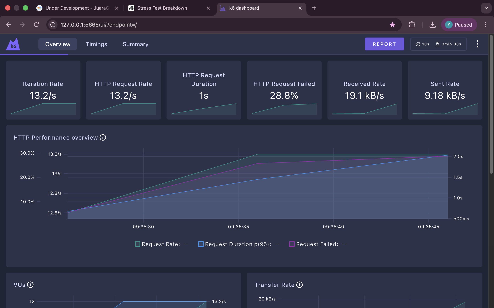
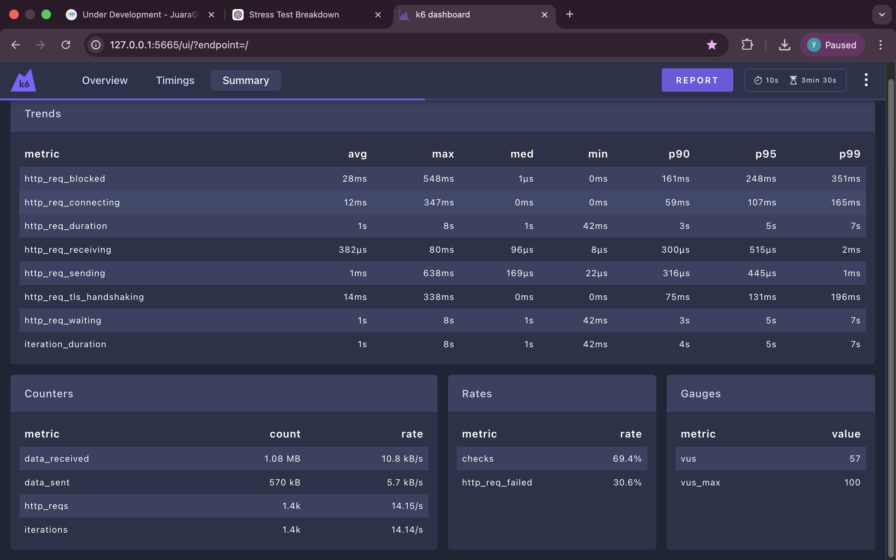
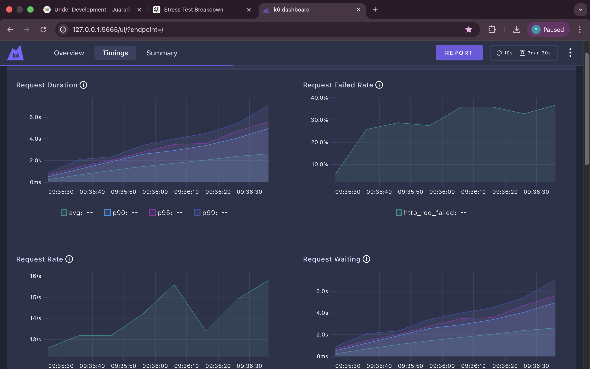

# 🚀 K6 Stress Test – PostTrx Tanamduit

## 📌 Overview

This repository contains a **k6 stress testing project** to evaluate the performance and stability of the following endpoints:

- `POST /api/Auth`
- `POST /api/PostTrx`

The goal of this test is to simulate high concurrency traffic and measure:

- Response time
- Error rate
- System stability
- Business logic validation under load

---

## 🧪 Test Configuration

| Parameter | Value |
|------------|--------|
| Test Type | Stress Test |
| Environment | Development |
| Max Virtual Users (VUs) | 100 |
| Duration | 3 Minutes |
| Ramp Stages | 4 Stages |
| Threshold (p95) | < 1000ms |
| Threshold (Error Rate) | < 1% |
| Tool | Grafana k6 |
| Database | SQL Server |

---

## 📁 Project Structure

```
k6-posttrx-tanamduit/
│
├── scripts/               # k6 test scripts
│   ├── posttrx.js
│   ├── auth.js
│   ├── config.js
│   └── data.js
│
├── reports/               # generated reports (JSON / HTML)
│   ├── report-posttrx.json
│   └── k6-dashboard.html
│
├── screenshots/           # dashboard result screenshots
│
└── README.md
```

---

## 🛠 How To Run

### ▶ Run Standard Test

```bash
k6 run scripts/posttrx.js
```

---

### 📊 Run With Web Dashboard

```bash
K6_WEB_DASHBOARD=true k6 run scripts/posttrx.js
```

Then open:

```
http://127.0.0.1:5665
```

---

### 📁 Generate JSON Summary

```bash
k6 run scripts/posttrx.js --summary-export=reports/report-posttrx.json
```

---

### 📄 Generate HTML Report

Make sure this is inside `posttrx.js`:

```javascript
import { htmlReport } from "https://raw.githubusercontent.com/benc-uk/k6-reporter/main/dist/bundle.js";

export function handleSummary(data) {
  return {
    "reports/report-posttrx.html": htmlReport(data),
  };
}
```

Then run:

```bash
k6 run scripts/posttrx.js
```

---

## 📈 Result Screenshots

### Dashboard Overview

```md

```

### Summary Metrics

```md

```
### Timing Breakdown

```md

```
---

## 📊 Sample Performance Results

| Metric | Result |
|--------|--------|
| Avg Response Time | ~3s |
| p95 Response Time | ~7–9s |
| Error Rate | ~32–35% |
| Total Requests | ~2,500–3,000 |
| Max VUs | 100 |

---

## ⚠ Findings

- ❌ Error rate exceeded 1% threshold.
- ❌ p95 response time exceeded SLA (<1000ms).
- High concurrency caused latency increase.
- Some transactions failed under heavy load.

---

## 🎯 Conclusion

Under stress conditions (100 VUs for 3 minutes):

- System performance degraded significantly.
- Error rate increased beyond acceptable limit.
- Backend optimization and scaling improvements are required before production deployment.

---

## 💡 Improvement Recommendations

- Add connection pooling optimization
- Review database indexing strategy
- Optimize transaction handling
- Implement better error handling & retry logic
- Consider horizontal scaling

---

## 👩‍💻 Author

**Yurika Pristyani**  
Performance Testing | QA Engineering | Backend Validation  

---

## 📌 Notes

This project is part of performance testing practice and portfolio demonstration using Grafana k6.
